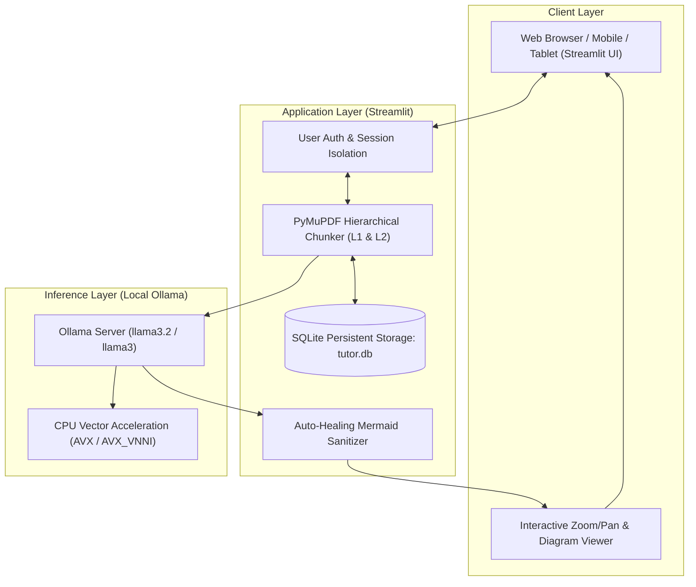

# PDF Reader AI Tutor 📚🤖

[](https://www.python.org/)
[](https://streamlit.io/)
[](https://ollama.com/)
[](https://pymupdf.readthedocs.io/)
[]()
[](LICENSE)

An intelligent, local-first academic textbook reader and interactive tutor powered by **Streamlit**, **PyMuPDF**, and **Ollama**. Turn any PDF book into an engaging masterclass with hierarchical chapter and subtopic navigation, auto-healing architectural Mermaid diagrams with interactive zoom/pan controls, verbatim textbook excerpts, real-world implementations, Socratic evaluation loops, and multi-user isolation.

---

## 🌟 Key Features

- 🌐 **Universal Cross-Disciplinary Tutor**: Dynamically detects the subject of any uploaded PDF—Computer Science, Distributed Systems, Economics, Finance, Biology, Philosophy, History, Law, or Mathematics—and adapts its pedagogical tone, depth, and terminology.
- 👥 **Multi-User Isolation & Authentication**: Built-in SQLite authentication with SHA-256 salted password hashing. Each user gets their own private bookshelf, isolated reading progress, and dedicated chat history.
- 📑 **Two-Tier Hierarchical Parsing**: Automatically extracts Level-1 Chapters/Parts from PDF bookmarks or table-of-contents, and intelligently chunks content into 500–1,100 word Level-2 Subtopics preserving logical paragraph boundaries.
- 📐 **Interactive Mermaid Architectural Diagrams**: Dynamically formulates process flows, state machines, and system architecture diagrams. Features an embedded interactive toolbar for **Zoom In (+)**, **Zoom Out (-)**, **Reset (⟲)**, **Fullscreen Modal**, and **Raw Source toggle**, backed by an auto-healing sanitizer that fixes syntax anomalies in real-time.
- 📜 **Verbatim Textbook Excerpts**: Pulls exact, unedited quotes from the uploaded PDF with page citations (`> [!NOTE] Verbatim Textbook Passage`) so you can study the author's original words alongside AI explanations.
- 💻 **Practical Real-World Implementations**: Provides production-grade code (C, C++, Python, Go, Rust, or SQL) or concrete industry case studies illustrating theoretical concepts.
- 💡 **Socratic Verification & Evaluation**: Generates challenging conceptual questions at the end of each subtopic. Validates user answers with constructive feedback, diagnoses misconceptions, offers hints, and unlocks progression upon mastery.
- 📶 **Local Network / Intranet Ready**: Seamlessly host on one machine and study from an iPad, tablet, phone, or laptop connected to the same home/office Wi-Fi.
- ⚡ **Optimized Hardware Execution**: Designed for Intel/AMD CPUs with AVX/AVX-VNNI hardware acceleration, eliminating integrated GPU driver TDR timeouts and ensuring rock-solid stability.

---

## 🏗️ Architecture & Pipeline



---

## 📋 Prerequisites

- **Python 3.10** or higher
- **Ollama** installed on your system (Download from [ollama.com](https://ollama.com))
- 8 GB+ RAM (16 GB recommended for smooth multi-tasking)

---

## 🪟 Windows Setup Guide

### 1. Install Python & Git
If you do not already have Python 3.10+ and Git installed:
```powershell
winget install --id Python.Python.3.12 --accept-source-agreements --accept-package-agreements
winget install --id Git.Git --accept-source-agreements --accept-package-agreements
```
> **Note**: During manual Python setup, ensure **"Add python.exe to PATH"** is checked.

### 2. Install & Start Ollama
Install Ollama via `winget` or direct installer from [ollama.com/download](https://ollama.com/download):
```powershell
winget install --id Ollama.Ollama --accept-source-agreements --accept-package-agreements
```
Pull the lightweight and fast `llama3.2` model (or `llama3`):
```powershell
ollama pull llama3.2
```

*(Recommended for stability on integrated GPUs)* Configure Ollama to utilize CPU AVX acceleration and allow LAN connections:
```powershell
[System.Environment]::SetEnvironmentVariable("OLLAMA_IGPU_ENABLE", "0", "User")
[System.Environment]::SetEnvironmentVariable("OLLAMA_HOST", "0.0.0.0:11434", "User")
```

### 3. Clone Repository & Setup Environment
Open PowerShell or Command Prompt:
```powershell
git clone https://github.com/Prasannav-105/pdf_reader_ai.git
cd pdf_reader_ai
```

Create and activate a virtual environment:
```powershell
python -m venv venv
.\venv\Scripts\Activate.ps1
```
*(If PowerShell restricts script execution, run `Set-ExecutionPolicy -Scope Process -ExecutionPolicy Bypass`)*

Install dependencies:
```powershell
pip install -r requirements.txt
```

### 4. Launch Application
You can run the application with a single command:
```powershell
streamlit run app.py
```
Or simply double-click **`start_windows.bat`**.

Access the app in your browser at:
- **Local machine**: `http://localhost:8501`
- **Other devices on Wi-Fi**: `http://<YOUR_LOCAL_IP>:8501` (displayed in the sidebar)

---

## 🐧 Linux Setup Guide (Ubuntu / Debian / Fedora / Arch / WSL2 / Headless Server)

### 1. Install System Dependencies
Update your package index and install Python, pip, venv, and curl:

**On Ubuntu / Debian:**
```bash
sudo apt update && sudo apt install -y python3 python3-pip python3-venv git curl
```

**On Fedora / RHEL:**
```bash
sudo dnf install -y python3 python3-pip git curl
```

**On Arch Linux:**
```bash
sudo pacman -S python python-pip git curl
```

### 2. Install & Start Ollama
Install Ollama with the official one-line script:
```bash
curl -fsSL https://ollama.com/install.sh | sh
```

Enable and start the Ollama system service:
```bash
sudo systemctl enable --now ollama
```

Pull the model:
```bash
ollama pull llama3.2
```

*(Optional)* If you are deploying on a headless Linux server or wish to access Ollama from across your network, expose `OLLAMA_HOST`:
```bash
sudo systemctl edit ollama
```
Add the following lines under `[Service]`:
```ini
[Service]
Environment="OLLAMA_HOST=0.0.0.0:11434"
Environment="OLLAMA_KEEP_ALIVE=24h"
```
Save and restart the service:
```bash
sudo systemctl daemon-reload
sudo systemctl restart ollama
```

### 3. Clone Repository & Setup Virtual Environment
```bash
git clone https://github.com/Prasannav-105/pdf_reader_ai.git
cd pdf_reader_ai

python3 -m venv venv
source venv/bin/activate
pip install -r requirements.txt
```

### 4. Launch Application
Start the Streamlit server bound to all network interfaces:
```bash
export PYTHONUTF8=1
streamlit run app.py --server.port 8501 --server.address 0.0.0.0
```
Or execute the helper script:
```bash
chmod +x start_linux.sh
./start_linux.sh
```

### 5. Running as a Background Service on Linux (Systemd)
To keep the tutor running permanently on a home server or VPS:
Create `/etc/systemd/system/pdf_reader_ai.service`:
```ini
[Unit]
Description=PDF Reader AI Tutor Service
After=network.target ollama.service

[Service]
Type=simple
User=YOUR_LINUX_USERNAME
WorkingDirectory=/path/to/pdf_reader_ai
Environment="PATH=/path/to/pdf_reader_ai/venv/bin:/usr/local/bin:/usr/bin"
Environment="PYTHONUTF8=1"
ExecStart=/path/to/pdf_reader_ai/venv/bin/streamlit run app.py --server.port 8501 --server.address 0.0.0.0 --server.headless true
Restart=always
RestartSec=5

[Install]
WantedBy=multi-user.target
```
Enable and start the service:
```bash
sudo systemctl daemon-reload
sudo systemctl enable --now pdf_reader_ai
```

---

## 📶 Local Intranet Access (Phone / Tablet / Remote PC)

You can read and learn from any smartphone, tablet, or secondary laptop on the same local Wi-Fi:

1. Look at the top or bottom of the sidebar for the **Intranet Address**: `http://<HOST_IP>:8501`.
2. Ensure your firewall permits port 8501:
   - **Windows Firewall**:
     ```powershell
     New-NetFirewallRule -DisplayName "Streamlit AI Tutor" -Direction Inbound -LocalPort 8501 -Protocol TCP -Action Allow
     ```
   - **Linux (`ufw`)**:
     ```bash
     sudo ufw allow 8501/tcp
     ```
3. Open `http://<HOST_IP>:8501` on your mobile browser, log into your user account, and enjoy an optimized reading experience!

---

## 🛠️ Configuration & Customization

| Parameter | Location | Description |
| :--- | :--- | :--- |
| **Model Selection** | Sidebar Settings | Default is `llama3.2`. Compatible with `llama3`, `deepseek-r1`, `mistral`, `qwen2.5`. |
| **Ollama Host** | Sidebar Settings | Default `http://127.0.0.1:11434`. Change to remote IP if Ollama is running on another box. |
| **Reading Theme** | Top Navigation | Choose between **Sepia Paper** (relaxed reading), **Crisp Light**, or **Slate Dark**. |
| **Chunk Size** | Internal Chunker | Calibrated to 500–1,100 words per subtopic to match Ollama optimal attention span and prevent hallucination. |

---

## ❓ Troubleshooting & FAQ

<details>
<summary><b>1. Ollama Connection Error (Status 500 or Connection Refused)</b></summary>
Ensure Ollama is actively running. In a terminal, run:
```bash
ollama serve
```
If you encounter <code>wsarecv: An existing connection was forcibly closed by the remote host</code>, your GPU driver may have reset due to a TDR timeout on integrated graphics. Force CPU execution by setting <code>OLLAMA_IGPU_ENABLE=0</code>.
</details>

<details>
<summary><b>2. Mermaid Diagram shows a syntax error or does not render</b></summary>
The built-in <code>sanitize_mermaid()</code> parser automatically heals duplicate headers, unquoted node labels, and markdown fences. If an uncommon diagram error occurs, click <b>"📐 Flow Diagram (Source)"</b> to inspect the raw Mermaid code or ask the AI Tutor to redraw it with different parameters.
</details>

<details>
<summary><b>3. How do I reset my user password or clear test data?</b></summary>
User accounts and reading sessions are stored in <code>tutor.db</code>. If you wish to wipe test accounts and start fresh, simply delete <code>tutor.db</code> (a clean database will be initialized automatically on the next launch).
</details>

---

## 🤝 Contributing

Contributions, issues, and feature suggestions are welcome!
1. Fork the repository
2. Create your feature branch (`git checkout -b feature/NewFeature`)
3. Commit your changes (`git commit -m "Add NewFeature"`)
4. Push to the branch (`git push origin feature/NewFeature`)
5. Open a Pull Request

---

## 📜 License

Distributed under the MIT License. See `LICENSE` for more information.

**Author**: [Prasanna V](https://github.com/Prasannav-105) (`prasannav105@gmail.com`)
