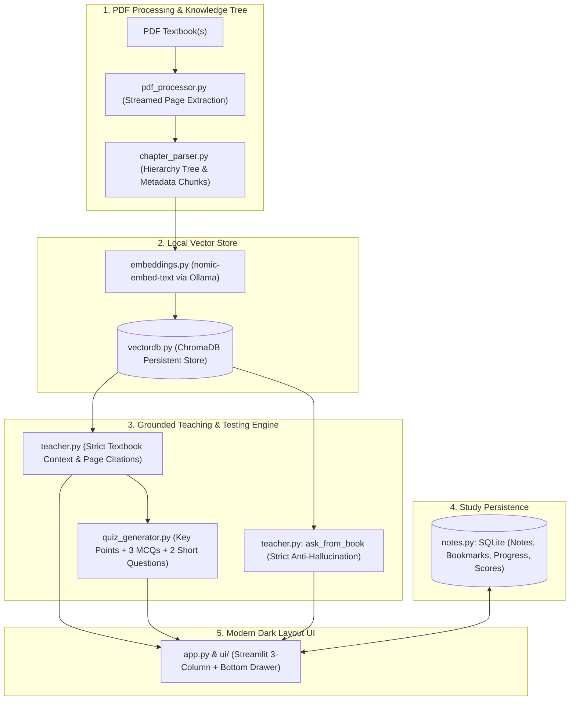

# AI Textbook Reader & Desktop Tutor 📚🤖

[](https://www.python.org/)
[](https://streamlit.io/)
[](https://ollama.com/)
[](https://www.trychroma.com/)
[](https://ollama.com/library/nomic-embed-text)
[](https://pymupdf.readthedocs.io/)
[]()
[](LICENSE)

An intelligent, 100% offline desktop academic textbook reader and pedagogical tutoring system powered by **Python**, **Streamlit**, **PyMuPDF**, **ChromaDB**, and **Ollama** (`llama3.2` + `nomic-embed-text`). 

> **Core Mission**: This is **not** a general AI chatbot. It is a strict textbook teaching system that reads textbooks chapter-wise, section-wise, and topic-wise, then teaches the student **only from the uploaded textbook** without hallucinating or using outside knowledge.

---

## 🌟 Key Features

- 🛡️ **Strict Anti-Hallucination Guard**: Uses retrieved textbook context exclusively. If asked questions outside the uploaded textbook, the system reliably answers:  
  `"This information is not available in the uploaded textbook."`
- 🧠 **ChromaDB Vector Store & nomic-embed-text**: Chunks textbooks with metadata (`book_name`, `unit`, `chapter`, `section`, `topic_title`, `page_number`) and indexes 768-dimensional dense embeddings in a persistent local vector database.
- 📑 **Hierarchical Knowledge Tree**: Detects Units, Chapters, Sections, Subsections, and exact page ranges. Scalable for massive textbooks exceeding 1,000 pages with cached structures.
- 📐 **Interactive Mermaid Architectural Diagrams**: Dynamically formulates process flows and architectural diagrams with an embedded interactive toolbar (**Zoom In +**, **Zoom Out -**, **Reset ⟲**) and auto-healing syntax repair.
- 🎯 **End-of-Section Mastery Verification**: Every section concludes with:
  - 📌 **Key Points** with page citations
  - 🔘 **3 Multiple Choice Questions (MCQs)** with immediate answer feedback and explanations
  - ✍️ **2 Conceptual Short-Answer Questions** with automated AI grading against the book's criteria
- 💬 **Ask From Book**: A grounded chat interface that retrieves relevant chunks from ChromaDB and answers with exact page numbers.
- 📊 **Comprehensive Study Suite**:
  - **Chapter Navigator**: Book → Unit → Chapter → Section tree
  - **Progress Tracker**: % of textbook completed and sections mastered
  - **Bookmarks & Notes**: Markdown notes and section bookmarks saved in SQLite
  - **Highlight Text**: Text snippets saved with color annotations
  - **Revision Mode**: Review flashcards, notes, and key takeaways
  - **Quiz Mode**: Comprehensive chapter assessments and historical scores
  - **Semantic Topic Search**: Query topics across the entire book with instant section jumping
  - **Continue Reading**: One-click resume from your exact last position

---

## 🏗️ Architecture & Pipeline



---

## 📂 Project Structure

```
pdf_reader_ai/
├── app.py              # Main application entry point & layout orchestrator
├── chapter_parser.py   # Hierarchical Knowledge Tree builder & semantic chunker
├── embeddings.py       # Ollama nomic-embed-text embedding engine (768-dim)
├── notes.py            # SQLite study features (Notes, Bookmarks, Highlights, Progress)
├── pdf_processor.py    # PyMuPDF scalable text & heading extractor (>1,000 pages)
├── quiz_generator.py   # MCQ & short question parser, evaluator & quiz mode
├── teacher.py          # Strict anti-hallucination teacher & Mermaid engine
├── vectordb.py         # ChromaDB persistent vector database manager
├── models/             # Strongly typed data models and schemas
│   ├── __init__.py
│   └── schema.py
├── ui/                 # Modular dark-themed UI components
│   ├── __init__.py
│   ├── chat_drawer.py   # Bottom 'Ask from Book' grounded Q&A drawer
│   ├── notes_panel.py   # Right study panel (Progress, Notes, Bookmarks)
│   ├── quiz_view.py     # Full chapter quiz & revision views
│   ├── sidebar.py       # Left navigation tree & mode switcher
│   ├── styles.py        # Dark theme visual styling tokens
│   └── teaching_view.py # Center teaching canvas with zoomable Mermaid viewer
├── requirements.txt    # Pinned dependencies
├── start_windows.bat   # One-click launch script for Windows
├── start_linux.sh      # One-click launch script for Linux / WSL
├── README.md           # Documentation
└── LICENSE             # MIT License
```

---

## 📋 Prerequisites

- **Python 3.10+** (Python 3.12 recommended)
- **Ollama** installed on your system ([ollama.com](https://ollama.com))
- Ollama models pulled:
  ```powershell
  ollama pull llama3.2
  ollama pull nomic-embed-text
  ```

---

## 🪟 Windows Setup Guide

### 1. Install Python & Ollama
```powershell
winget install --id Python.Python.3.12 --accept-source-agreements --accept-package-agreements
winget install --id Ollama.Ollama --accept-source-agreements --accept-package-agreements
```

### 2. Pull Required Models
```powershell
ollama pull llama3.2
ollama pull nomic-embed-text
```

### 3. CPU Mode Stability *(Recommended for integrated GPUs)*
```powershell
[System.Environment]::SetEnvironmentVariable("OLLAMA_IGPU_ENABLE", "0", "User")
[System.Environment]::SetEnvironmentVariable("OLLAMA_HOST", "0.0.0.0:11434", "User")
```

### 4. Clone Repository & Run
```powershell
git clone https://github.com/Prasannav-105/pdf_reader_ai.git
cd pdf_reader_ai
python -m venv venv
.\venv\Scripts\Activate.ps1
pip install -r requirements.txt
streamlit run app.py
```
*(Or simply double-click **`start_windows.bat`**).*

---

## 🐧 Linux Setup Guide (Ubuntu / Debian / Fedora / WSL2)

```bash
# Install dependencies
sudo apt update && sudo apt install -y python3 python3-pip python3-venv git curl

# Install Ollama & pull models
curl -fsSL https://ollama.com/install.sh | sh
sudo systemctl enable --now ollama
ollama pull llama3.2
ollama pull nomic-embed-text

# Clone & Launch
git clone https://github.com/Prasannav-105/pdf_reader_ai.git
cd pdf_reader_ai
python3 -m venv venv
source venv/bin/activate
pip install -r requirements.txt
streamlit run app.py --server.port 8501 --server.address 0.0.0.0
```

---

## 📜 License

Distributed under the MIT License. See `LICENSE` for details.

**Author**: [Prasanna V](https://github.com/Prasannav-105) (`prasannav105@gmail.com`)
